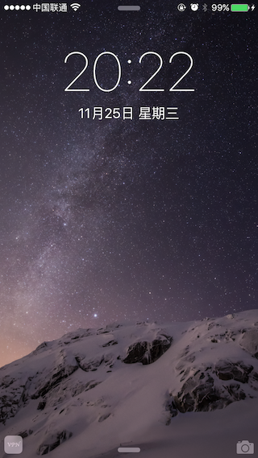
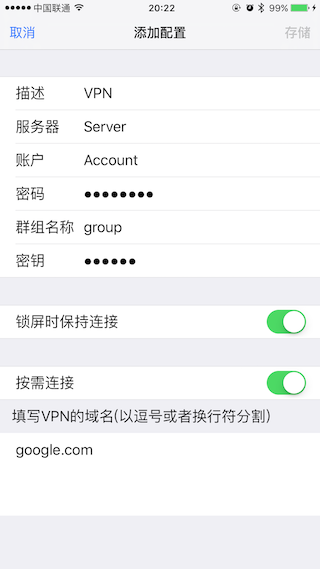

# Handoff

## Snapshots

#### Originating App(iPad)


#### Continuing App(iPhone)

                    

## 前提条件

-   以相同的iCloud账号登录
-   蓝牙LE 4.0
-   iOS 8.0+
-   相同的Developer Team Identifier
-   支持指定的Activity Type


## Steps

### 一、添加支持的Activity Type类型

在**info.plist**文件里添加**NSUserActivityTypes** item，如


### 二、Originating App

#### 1. Start user activity

``` swift
func startUserActivity() { 
    let activity = NSUserActivity(activityType: "com.zte.vpn.addvpn")
    activity.title = "Title"
    activity.userInfo = [key: value]
    self.userActivity = activity
    self.userActivity?.becomeCurrent()
}
```

#### 2. Update user activity

``` swift
func textFieldTextDidChanged(notification: NSNotification) {
	self.userActivity?.needsSave = true
}
```

``` swift
override func updateUserActivityState(activity: NSUserActivity) {
	activity.addUserInfoEntriesFromDictionary([key: value])
	super.updateUserActivityState(activity)
}
```

#### 3. Invalidate user activity

``` swift
func stopUserActivity() {
	self.userActivity?.invalidate()
}
```

### 三、Continuing App

#### 4. Receive user activity

``` swift
func application(application: UIApplication, willContinueUserActivityWithType userActivityType: String) -> Bool {
    return true
}

func application(application: UIApplication, continueUserActivity userActivity: NSUserActivity, restorationHandler: ([AnyObject]?) -> Void) -> Bool {
    let controller = ...
    controller.restoreUserActivityState(userActivity)
}
```

#### 5. Restore user activity

``` swift
override func restoreUserActivityState(activity: NSUserActivity) {
	//Padding, such as
    self.textField.text = activity.userInfo[key] as? String
}
```

#### 6. Versioning

``` swift
func application(application: UIApplication, didUpdateUserActivity userActivity: NSUserActivity) {
    userActivity.addUserInfoEntriesFromDictionary([versionKey: versionValue])
}
```

## References

*   [NSUserActivity Class Reference](https://developer.apple.com/library/ios/documentation/Foundation/Reference/NSUserActivity_Class/index.html#//apple_ref/doc/uid/TP40014322)
*   [NSUserActivityDelegate Protocol Reference](https://developer.apple.com/library/ios/documentation/AppKit/Reference/NSUserActivityDelegate_Protocol/index.html#//apple_ref/doc/uid/TP40014337)
*   [UIApplicationDelegate Protocol Reference](https://developer.apple.com/library/ios/documentation/UIKit/Reference/UIApplicationDelegate_Protocol/index.html#//apple_ref/doc/uid/TP40006786)
*   [Handoff Programming Guide](https://developer.apple.com/library/ios/documentation/UserExperience/Conceptual/Handoff/HandoffFundamentals/HandoffFundamentals.html#//apple_ref/doc/uid/TP40014338)
*   iOS 8 by Tutorials