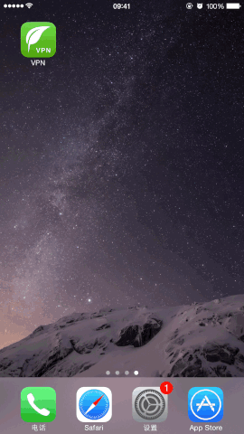

# Open-VPN

**方便用户快速地配置、打开以及关闭VPN，使用iOS 8 [Network Extension Framework](https://developer.apple.com/library/ios/documentation/NetworkExtension/Reference/Network_Extension_Framework_Reference/index.html#//apple_ref/doc/uid/TP40016234)。**

**Note:** 这个不是VPN服务器，也没有提供VPN账号，只是方便用户使用VPN服务。

## Screenshot

## Features

1.  界面简洁
2.  支持IPSec
3.  支持按需打开VPN
4.  支持Today Widget

## Build

为了编译工程，您需要修改bundle_id以及VPN和VPN Widget的Capabilities

+   Personal VPN
+   Keychain Sharing
+   App Groups

## 3rd Party Library

*   [UICKeyChainStore](https://github.com/kishikawakatsumi/UICKeyChainStore)

## Version

##### V2.0.0

1.  用**Swift 2.0** 实现
2.  支持iPad

##### V1.1.0

解决iOS 9的问题：

1.  第一次连接VPN时，提示安装VPN到设备，startVPNTunnel会调用失败，但是没有NEVPNStatusDidChangeNotification通知消息；
2.  第一次saveToPreferences安装VPN到设备之后回到App，需要再调用loadFromPreferences，加载VPN设置

## Requirements

iOS 8.0+